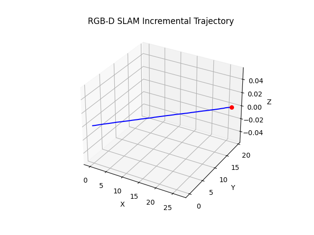

# RGB-D Visual SLAM


This repository implements a **simple RGB-D Visual SLAM** pipeline using OpenCV and Python.  
It takes synchronized RGB and depth images, estimates the camera trajectory, and visualizes the motion in 3D.

## 📦 Installation

```bash
# Clone the repository
git clone https://github.com/AashishKumbashi/prefiro_rgbd_slam.git
cd prefiro_rgbd_slam

# Create and activate Python virtual environment
python3 -m venv venv
source venv/bin/activate 
# On Windows: venv\Scripts\activate

# Install dependencies
pip install -r requirements.txt
````

## 📂 Data Preparation

1. Create folder and copy your image folders into `data/`:

   ```
   mkdir data
   data/images_1min/
   data/depth_1min/
   ```
3. Make sure RGB and depth images share the same timestamp format, so they can be paired correctly. This is taken care by the regex check present in the dataloader.

## ▶️ Running SLAM

```bash
python run_slam.py \
    --rgb_dir data/images_1_rgb/ \
    --depth_dir data/depth_1/ \
    --config config/camera_parameters.yaml \
    --output_dir outputs/
```

* `--rgb_dir` → Folder with RGB images (`.png`/`.jpg`)
* `--depth_dir` → Folder with depth images (`.png`)
* `--config` → Camera intrinsic parameters in YAML format
* `--output_dir` → Folder where trajectory plot is saved

Example camera config file (`camera_parameters.yaml`):

```yaml

fx: 1251.244140625
fy: 1251.244140625
cx: 937.5733642578125
cy: 606.0010986328125
width: 1920
height: 1200
distortion: [
    -2.3162899017333984,
    6.9746198654174805,
    0.0004106209962628782,
    -0.0002918379905167967,
    -2.164750099182129,
    -2.2418301105499268,
    6.78918981552124,
    -1.579259991645813,
    0.0,
    0.0,
    0.0,
    0.0
]
FPS: 15
```

## 🧠 Approach

This implementation follows a **feature-based RGB-D SLAM pipeline**:

1. **Load Camera Intrinsics**
   Read focal lengths, principal point, distortion coefficients, and depth scale from a YAML config.

2. **Image Loading & Synchronization**
   RGB and depth images are matched by timestamps (sorted by middle and last parts of the filename) using regex.

3. **Feature Extraction**
   ORB features are extracted from undistorted RGB images.

4. **Feature Matching**
   Brute-force Hamming matching is used to match descriptors between consecutive frames.

5. **3D Point Reconstruction**
   Depth images are used to back-project matched 2D keypoints into 3D camera coordinates.

6. **Pose Estimation**
   Using 3D-2D correspondences, `cv2.solvePnPRansac` estimates camera rotation and translation.

7. **Trajectory Accumulation**
   The camera pose is updated incrementally and plotted in real time.

8. **Visualization**
   A live 3D trajectory plot is displayed and saved to `trajectory.png`. 

9. **Distance Measurement**
    The distance covered by the camera as estimated by the algorithm is displayed in the terminal in meters. 

## 📜 Assumptions

* RGB and depth images are perfectly synchronized and aligned (same resolution & timestamps).
* Depth maps store depth in millimeters, scaled by `depth_scale` (default 1000.0).
* Camera intrinsics and distortion parameters are known and accurate.
* Scene has sufficient texture for ORB feature detection.
* Higher weightage is provided to translation along the XY plane considering that the setup is moving on a flat ground.
* Translation along Z is set to 0 (TBD).

## ⚠️ Limitations

* **No loop closure** → Drift accumulates over time if not for the hard constraint on Z dimension.
* **No keyframe selection** → Every frame is processed sequentially, which may be inefficient.
* **No bundle adjustment** → Poses are estimated only between consecutive frames, without global optimization.
* **Feature matching sensitivity** → Poor matches in low-texture or dynamic scenes can degrade accuracy.
* Depth measurements are assumed noise-free; no filtering is applied.

## 🚀 Possible Improvements

* **Loop Closure**
  Detect revisited locations and correct trajectory drift. Might be relevant when more data is involved.
* **Keyframe Management**
  Use only selected keyframes to improve speed and robustness.
* **Bundle Adjustment**
  Optimize poses and 3D structure jointly for better accuracy.

## 📷 Output Example

Trajectory visualization (`outputs/trajectory.png`):




